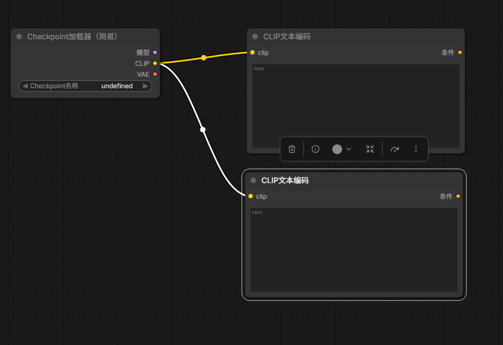
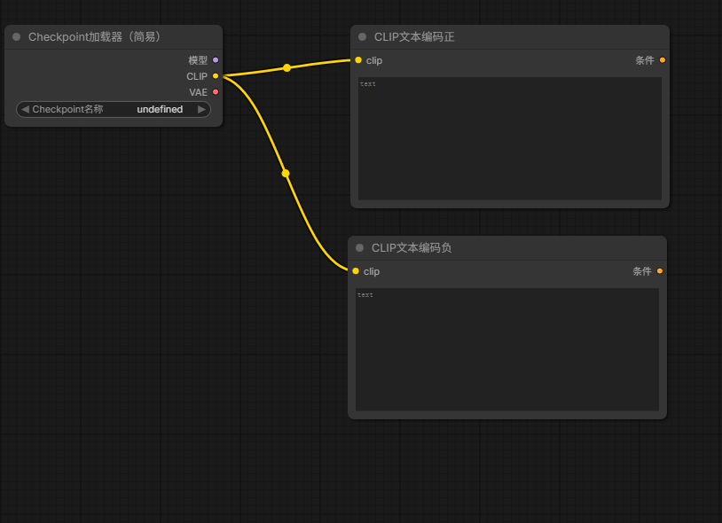

# ComfyUI 小白上手学习指南（通用版）

> 适用：零基础新手，第一次接触 ComfyUI
> 界面：中文面板（节点名以中文界面为准）
> 目标：从"装好软件"到"跑出第一张图"，并理解每个节点在干什么

---

## 0. 先建立 3 个直觉

1. **ComfyUI 不是 App，是"节点画布"**。你不是填表单，而是把一个个方块（节点）用线连起来，数据从上游流到下游，最后出图/出视频。
2. **一个典型生图流程 = 4 类节点**：
   - 加载模型（Checkpoint 加载器）
   - 写提示词（正/负 CLIP 文本编码）
   - 设置尺寸/采样（空 Latent 图像 + K 采样器）
   - 解码出图（VAE 解码 → 保存图像）
3. **"工作流"就是这张连好的图**，存成 `.json` 可反复用。社区大量现成工作流，小白直接套用即可。

---

## 1. 安装 ComfyUI

ComfyUI 是开源的，有**官方桌面版（最简单）**和**源码版（可玩节点开发）**两种。新手推荐桌面版。

### 方式 A：官方桌面版（Windows / macOS 最简单）
1. 去官网 https://www.comfy.org/ 下载「ComfyUI Desktop」安装包。
2. 一路安装，打开后自带 Python 环境，点「启动」就能用。
3. 模型目录默认在：
   ```
   Windows: C:\Users\你的用户名\ComfyUI\models\checkpoints\
   ```
> 桌面版内置更新按钮，不用手敲命令，最适合纯小白。

### 方式 B：源码版（Windows / Linux / WSL 通用）
需要自己装 Python（≥3.10）和 Git。

**Windows（PowerShell / CMD）**：
```powershell
git clone https://github.com/comfyanonymous/ComfyUI.git
cd ComfyUI
python -m venv venv
venv\Scripts\activate
pip install -r requirements.txt
python main.py
```

**Linux / WSL / macOS（终端）**：
```bash
git clone https://github.com/comfyanonymous/ComfyUI.git
cd ComfyUI
python -m venv venv
source venv/bin/activate
pip install -r requirements.txt
python main.py
```

启动后看到 `To see the GUI go to: http://127.0.0.1:8188` 即成功。
浏览器打开 **http://127.0.0.1:8188**（本机）或 **http://localhost:8188**（WSL 下 Windows 浏览器）。

> 常用启动参数：
> - `--listen 0.0.0.0` 允许局域网/其他设备访问（WSL 下让 Windows 浏览器能开）
> - `--port 8189` 换端口
> - 显存小（如 8GB）跑大模型若 OOM，加 `--lowvram` 或 `--novram`（更慢）
> 后台运行：`nohup python main.py --listen 0.0.0.0 --port 8188 > comfy.log 2>&1 &`；停止 `pkill -f "main.py"`

### 本文档里的路径约定
后面所有 `ComfyUI/models/...` 都指你**实际安装目录**下的 `models` 子目录。例如：
- Windows 源码版：`C:\xxx\ComfyUI\models\`
- WSL：`/home/你的用户/ComfyUI/ComfyUI/models/`

---

## 2. 界面速览（第一次打开看这里）

打开后是块"画布"，关键区域：
- **左侧边栏**：节点列表、工作流（Load/Save）、模板库（Templates）、队列。
- **中间**：画布，拖节点、拉连线。
- **右侧**：选中节点的参数面板。
- **顶部**：运行（Queue Prompt）按钮、工作流标题。

**加节点的两种方式**：
- **方式 A（推荐）**：画布上**双击左键** → 弹出搜索框 → 输入中文或英文关键词（如 `checkpoint`、`采样`、`vae`）→ 回车插入。
- **方式 B（菜单）**：**右键画布 → 添加节点** → 按分类逐级展开。

**小白最快路径**：直接用模板库，别手搓节点（见 §2.5）。

---

## 2.5 模板加载图文步骤（最快上手）

不用手搓节点，用官方内置 **Templates（模板库）** 一键加载现成工作流。以「文生图」为例。

1. **打开模板库**：左侧边栏点 **Templates（模板）** 图标。
2. **选分类**：点 **Image → Text to Image（文生图）**，挑一个简单的（如 `SD1.5`）。
3. **加载**：点卡片上的 **Load / 加载**（或双击卡片），画布自动出现连好的节点图。
4. **处理缺模型**：若弹「缺少模型」，点 **下载**（联网自动拉取），或手动放模型（见第 4 节）。
5. **运行**：改提示词 → 点顶部 **运行（Queue Prompt）** → 出图在保存图像节点上。
6. **保存**（可选）：`Ctrl+S` 存成 `.json`，下次直接 `Ctrl+O` 加载。

---

## 3. 第一个练习：从 0 手动搭建文生图（理解每个节点）

理解了模板后，建议手搓一遍，真正搞懂节点关系。共 6 类节点，下面**每个节点都给详细解释**。

### 节点 1：Checkpoint 加载器（简易）
- **怎么加**：双击画布搜 `checkpoint` → 选 **Checkpoint加载器（简易）**；或 右键 → 添加节点 → 模型 → 加载器 → Checkpoint加载器（简易）
- **它是什么**：加载主模型文件（`.safetensors`/`.ckpt`），一个文件包含「去噪用的模型结构 + 文本理解用的 CLIP + 图片解码用的 VAE」三部分。
- **关键参数**：`ckpt_name` 下拉选你的模型（为空 = `models/checkpoints/` 没文件，会报错）。
- **输出口**：右侧有 3 个圆点——`MODEL`（给采样器）、`CLIP`（给提示词节点）、`VAE`（给解码器）。**一个节点同时供三个下游用**，最省事。



### 节点 2：CLIP 文本编码（正 / 负）×2
- **怎么加**：双击画布搜 `CLIP文本编码` 回车，加 **2 个**；或 右键 → 添加节点 → 条件 → CLIP文本编码。建议右键节点标题分别改名「正」「负」。
- **它是什么**：把**人话提示词**翻译成模型能懂的「向量条件」。模型本身看不懂文字，必须过这一步。
- **关键参数**：`text` 填提示词。正节点写想要的内容（如 `a cute cat, sunny garden, masterpiece`），负节点写不想要的（如 `blurry, low quality, deformed`）。
- **输入口**：`clip` ← 来自节点1的 `CLIP` 输出。
- **输出口**：`CONDITIONING` → 后面 K 采样器的 `positive` / `negative`。
- 正确连线：节点1的 `CLIP` 同时引两条线，分别连两个 CLIP 文本编码的 `clip` 口（见下图）。



### 节点 3：空 Latent 图像
- **怎么加**：双击搜 `空Latent图像`；或 右键 → 添加节点 → 潜空间 → 空Latent图像
- **它是什么**：定义**要生成图片的尺寸和数量**。注意这里不是真图，而是「一张空白的潜空间画布」，模型在潜空间里去噪，最后才解码成可见图。
- **关键参数**：`width`/`height`（SD1.5 用 512，SDXL 用 1024）、`batch_size`（一次出几张，新手设 1）。
- **输出口**：`LATENT` → K 采样器的 `latent_image`。

### 节点 4：K 采样器（核心）
- **怎么加**：双击搜 `K采样器`；或 右键 → 添加节点 → 采样 → K采样器
- **它是什么**：**出图的核心引擎**。它在潜空间里反复迭代「去噪」，把随机噪声一步步变成符合提示词的画面。步数越多越精细但越慢。
- **关键参数**：
  - `seed`：随机种子（点骰子随机；固定种子可复现同一张图）
  - `steps`：迭代步数（20 够用，质量优先可 30）
  - `cfg`：提示词遵循强度（7~8 常用，太高画面会脏）
  - `sampler_name`：采样算法（新手用 `euler`）
  - `scheduler`：噪声调度（用 `normal` 或 `simple`）
  - `denoise`：去噪强度（文生图设 1.0 = 从头生成）
- **输入口**（4 个都要连）：
  - `model` ← 节点1 `MODEL`
  - `positive` ← 正 CLIP 文本编码 `CONDITIONING`
  - `negative` ← 负 CLIP 文本编码 `CONDITIONING`
  - `latent_image` ← 节点3 空Latent图像 `LATENT`
- **输出口**：`LATENT` → VAE 解码的 `samples`。

### 节点 5：VAE 解码
- **怎么加**：双击搜 `VAE解码`；或 右键 → 添加节点 → 潜空间 → VAE解码
- **它是什么**：把潜空间里的数据**解码成肉眼可见的图片**。对应节点1输出的 `VAE`。
- **输入口**：`samples` ← 节点4 K 采样器 `LATENT`；`vae` ← 节点1 `VAE`
- **输出口**：`IMAGE` → 保存/预览图像的 `images`。

### 节点 6：保存图像 / 预览图像
- **怎么加**：双击搜 `保存图像` 或 `预览图像`
- **它是什么**：把生成结果落盘（保存图像）或仅在界面显示（预览图像）。
- **输入口**：`images` ← 节点5 VAE 解码 `IMAGE`。

### 完整主链图
```
Checkpoint加载器（简易）─┬─ MODEL ─→ K采样器 ─ LATENT → VAE解码 → 保存图像
                       ├─ CLIP ─→ 正 CLIP文本编码 ─┘(positive)
                       ├─ CLIP ─→ 负 CLIP文本编码 ─┘(negative)
                       └─ VAE ───────────────────→ VAE解码(vae)
空Latent图像 ─────────────→ K采样器(latent_image)
```

### 运行
两个 CLIP 文本编码填好正/负提示词，点顶部 **运行（Queue Prompt）**，等进度条走完出图。

> **本指南自带示例**：`examples/文生图.json` 是已搭好的完整工作流，菜单 `Load`（或 `Ctrl+O`）一键还原，改提示词直接运行。

---

## 4. 模型放哪（必懂，不然报"找不到"/ckpt_name 为空）

ComfyUI 按类型分目录，放错地方节点里选不到：
```
ComfyUI/models/
├── checkpoints/     普通 SD1.5/SDXL 大模型(.safetensors/.ckpt)  ← 文生图放这里
├── diffusion_models/ 新版 DiT 模型(如 MiniMax H3 的 DiT)
├── text_encoders/   文本编码器(如 H3 的 Qwen3-VL)
├── vae/              VAE(图像/视频解码器)
├── loras/            LoRA 微调权重
└── clip/             CLIP 文本编码器(老格式)
```
`ckpt_name` 显示「无效输入」就是 `checkpoints/` 空的。放一个 `.safetensors` 进去，刷新浏览器（F5）就出现。

**新手推荐模型**：SD1.5 `v1-5-pruned-emaonly.safetensors`（约 4GB，8GB 显存能跑）。下载后放到 `ComfyUI/models/checkpoints/`。
下载源：HuggingFace（`runwayml/stable-diffusion-v1-5`）或 Civitai，国内用镜像 `hf-mirror.com` 更快。

---

## 5. 核心概念扫盲

| 词 | 白话 |
|---|---|
| Checkpoint / 大模型 | 生成的主模型，决定画风与能力 |
| CLIP / 文本编码 | 把文字提示词翻译成模型懂的向量 |
| VAE / 解码器 | 把"潜空间数据"解码成可见图片 |
| Latent / 潜空间 | 模型内部运算的中间数据（你看不到，要 VAE 解码） |
| K 采样器 | 控制"迭代多少步、怎么去噪"出图的核心引擎 |
| Prompt 正/负 | 想要什么 / 不想要什么 |
| LoRA | 小插件，给大模型加特定风格/角色，叠加用 |
| 队列 Queue | 把任务排进执行队列，可连续跑多个 |
| 工作流 .json | 连好的节点图，可保存/分享/加载 |

---

## 6. 日常操作技巧

- **保存/加载工作流**：`Ctrl+S` 存 `.json`，`Ctrl+O` 加载；或左侧「工作流」面板里的按钮。
- **加载他人工作流**：`Ctrl+O` 选 `.json`；缺模型时节点变红，按名字去下对应模型放对目录。
- **改提示词重跑**：改完直接运行，不用重连。
- **看报错**：底部状态栏 + 终端日志。常见："ckpt_name 无效"=没模型；"CUDA out of memory"=显存爆，加 `--lowvram` 或换小模型。
- **管理模型**：用 `models/` 子目录分类。

---

## 7. 进阶：MiniMax H3 等大模型（硬件要求高）

H3 是开源视频生成模型，节点已内置在较新 ComfyUI，但：
- **最小权重组合约 44GB**，需要 ≥24GB 显存的显卡才能跑；普通 8GB 显卡跑不了。
- 想玩这类大模型：要么租用云 GPU（如腾讯云 CVM ≥24GB），要么升级本地硬件。
- 新手先把 SD1.5 文生图跑顺，再考虑进阶模型。

---

## 8. 学习资源

- 官方文档：https://docs.comfy.org/zh
- 模板库：ComfyUI 左侧 Templates（内置）
- 模型下载：HuggingFace / Civitai（国内用 hf-mirror.com 或 ModelScope）
- 社区工作流：ComfyUI 官方论坛、Civitai

---

## 9. 常见问题（小白高频）

| 现象 | 原因 / 处理 |
|---|---|
| 打开 8188 空白/连不上 | ComfyUI 没启动；确认终端有 "To see the GUI" 那行 |
| `ckpt_name` 无效 / 显示 undefined | `models/checkpoints/` 没模型 → 下放一个，F5 刷新 |
| 节点是红的 | 缺模型或模型放错目录 → 看第 4 节 |
| CUDA out of memory | 显存爆 → 换小模型，或 `python main.py --lowvram` |
| 出图全黑/糊 | 提示词太短、steps 太少、负提示词没写；调 cfg/steps |
| 找不到某个节点 | 双击画布搜中文/英文；或需装 ComfyUI-Manager 扩节点 |
| 下载模型慢 | 换 hf-mirror.com 镜像或 ModelScope |

---

> 记住一句话：**先跑通一个小模型文生图，再谈大模型和视频。** ComfyUI 的学习曲线在"第一次连对节点"，之后全是复用工作流。
