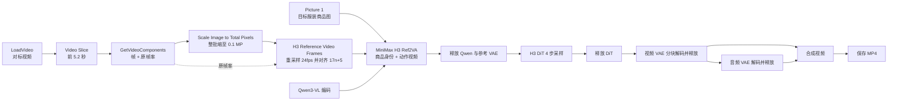

# 映海“复刻爆款带货视频”本地 H3 工作流

这一章复刻的是[映海公开案例](reference-site-video-audit-2026-09-01.md)能观察到的产品方向：

- 商品图决定新服装的颜色、版型和装饰；
- 对标视频决定人物动作、镜头推进、节奏和场景；
- 最终生成一段“参考动作，但换成目标商品”的竖屏带货视频。

配套工作流分成一个历史基线和两个统一 0.2 MP 的内容案例：

- [0.1 MP 稳定基线](workflows/ecommerce-yinghai-copy-hot-video-h3-nvfp4-low-vram.json)：只用于最低配置排错和历史对照；
- [内容 A｜0.2 MP｜白花长裙 + 前半段行走](workflows/ecommerce-yinghai-copy-hot-video-h3-nvfp4-0.2mp.json)；
- [内容 B｜0.2 MP｜1977 卫衣 + 后半段摘墨镜](workflows/ecommerce-yinghai-copy-hot-video-h3-nvfp4-0.2mp-hoodie-second-half.json)。

这些都是本地 MiniMax H3 的**5 秒低显存验证版**，不是网站服务端私有工作流。分辨率升级验证完成后，内容 A/B 固定使用同一个 0.2 MP；它们更换商品和动作片段，用来判断链路是否只对单一案例有效。网站公开结果约 11 秒、文件为 1080×1920，本地还没有声称画质或完整功能已经追平。

## 1. 你将得到什么

第一次运行固定使用网站公开案例：

```text
Picture 1：黑色 V 领白花长裙商品图
Video 1：街景人物行走、推进和摘墨镜的对标视频
0.1 MP 输出：约 5 秒、9:16、256×416
内容 A：长裙 + 前 5.2 秒行走推进，0.2 MP、352×608
内容 B：1977 卫衣 + 5.0–10.2 秒摘墨镜近景，0.2 MP、352×608
```

通过标准不是“视频能播放”这么简单。正确结果应同时满足：

1. 人物动作和镜头方向能看出来自 Video 1；
2. 人物身上不再是对标视频原来的白色露肩上衣；
3. 黑色 V 领长裙和白花装饰仍可识别；
4. 没有多件衣服、字幕、水印、严重手脸错误或连续闪变。

## 2. 与网站功能的对应关系

| 网站公开表单 | 本地首版对应 | 当前边界 |
|---|---|---|
| 对标视频 3–20 秒 | `LoadVideo` + `Video Slice` | 只取前 5.2 秒 |
| 商品图 1–5 张 | `Picture 1` | 先只用 1 张 |
| 场景图 0–8 张 | 暂无 | 场景直接参考 Video 1 |
| 自定义模特 | 暂无独立开关 | 人物方向参考 Video 1 |
| 阶段式执行、2K 图片阶段 | 暂无 | 直接使用 H3 Ref2VA |
| SD-2.0-Mini、720P | 本地 H3 NVFP4/INT8 组合 | 0.1 MP 基线 + 0.2 MP 单变量 A/B |
| 是否使用对标 BGM | 参考音频断开 | H3 只生成安静环境声，不复制音乐 |
| 约 11 秒结果 | 约 5 秒 | 完整时长以后拆成两段验证 |

## 3. 运行前准备

### 3.1 模型与自定义节点

先完成[第 9 章](09-MiniMax-H3本地模型有限配置工作流.md)的量化模型下载、硬件检测和启动参数。NVFP4 工作流需要以下五个文件：

```text
ComfyUI-Shared/models/
├── diffusion_models/minimax_h3_ref2va_pruned_int8_convrot.safetensors
├── text_encoders/qwen3vl_32b_minimax_h3_nvfp4_awq.safetensors
├── vae/minimax_h3_video_vae_fp16.safetensors
├── vae/minimax_h3_audio_vae_fp32.safetensors
└── loras/minimax_h3_ref2v_turbo_4step_v0.1_comfyui_bf16.safetensors
```

把仓库中的整个目录：

```text
custom_nodes/comfyui_adaptive_memory
```

复制到当前实例：

```text
ComfyUI/custom_nodes/comfyui_adaptive_memory
```

这次新增的节点叫：

```text
H3 Reference Video Frames (24 FPS)
```

若复制后仍显示红色“缺失节点”，必须完全关闭并重新启动 ComfyUI，单纯刷新浏览器不够。

### 3.2 下载公开对比素材

在 Windows 仓库根目录运行：

```bat
scripts\download_yinghai_copy_hot_video_public_case_windows.cmd "%LOCALAPPDATA%\Comfy-Desktop\ComfyUI-Shared\input"
```

下载完成后应看到：

```text
ComfyUI-Shared/input/
├── yinghai-copy-hot-video-v2-01-benchmark.mp4
├── yinghai-copy-hot-video-v2-02-product.png
└── yinghai-copy-hot-video-v2-03-site-result.mp4
```

前两个文件参与生成，第三个只用于人工对比。脚本支持 `.download` 断点续传，并检查公开文件的字节数和 SHA-256；仓库不分发这些第三方素材。

这里特意把三个文件放在 `input` 根目录，而不是子目录。实机验证的 ComfyUI `0.33.4` 中，核心 `LoadImage` 的可选文件列表只扫描根目录；放进子目录虽然文件真实存在，前端仍会报“所需的媒体输入未选择文件”。文件名前缀承担分类作用。

### 3.3 内容 B 的卫衣商品图

内容 B 使用前面公开案例中已经保存在本机的 `01-product-1977-hoodie.png`，仓库不分发该第三方图片。若你已经完成卫衣对比案例，在 Windows 命令提示符执行：

```bat
copy /Y "%LOCALAPPDATA%\Comfy-Desktop\ComfyUI-Shared\input\yinghai-hoodie-comparison\01-product-1977-hoodie.png" "%LOCALAPPDATA%\Comfy-Desktop\ComfyUI-Shared\input\01-product-1977-hoodie.png"
```

正确文件为 `534×642`、`378,549 B`，SHA-256：

```text
5cc9ab74ec3f09b47e5d921a5f9af37dc22f02eb14edc6217d24f4d3ee950082
```

没有这张图片也可以导入内容 B 工作流，然后在 `Picture 1` 节点改选自己的清晰单件服装图；此时它是你的第三个内容案例，不再与本文 `1977` 验收表逐项对照。

## 4. 导入并首跑

1. 用第 9 章的量化启动脚本启动实例。
2. 第一次排错可导入 0.1 MP 基线；基线已成功后，日常验证直接导入内容 A 或内容 B 的 0.2 MP JSON。
3. 确认 `Picture 1` 已选中 `yinghai-copy-hot-video-v2-02-product.png`。
4. 确认 `Video1` 已选中 `yinghai-copy-hot-video-v2-01-benchmark.mp4`。
5. 不在画布里手改分辨率、时长、步数、参考帧像素或自适应内存参数；内容 A/B 已统一固定为 0.2 MP。
6. 点击“运行”。第一次加载几十 GiB 本地权重，长时间磁盘繁忙并不等于程序卡死；观察终端是否仍有读取或阶段日志。

输出默认保存在：

```text
ComfyUI-Shared/output/ecommerce/video/yinghai-copy-hot-video-h3-nvfp4-low-vram_*.mp4
```

0.2 MP 档使用独立文件名，不会覆盖基线：

```text
ComfyUI-Shared/output/ecommerce/video/yinghai-copy-hot-video-h3-nvfp4-low-vram-0.2mp_*.mp4
```

内容 B 也有独立文件名：

```text
ComfyUI-Shared/output/ecommerce/video/yinghai-copy-hot-video-h3-nvfp4-low-vram-0.2mp-hoodie-second-half_*.mp4
```

真机验证还生成了一条左右同屏片；两边都为 0.2 MP，不是多分辨率输出：

```text
ComfyUI-Shared/output/ecommerce/video/yinghai-copy-hot-video-h3-0.2mp-content-ab-compare.mp4
```

## 5. 工作流总览



这里最重要的是两条参考的职责不能混：`Picture 1` 是唯一服装身份，`Video 1` 只负责动作、镜头、节奏和场景。

## 6. 每个新增节点的功能

### 6.1 `LoadVideo`：加载对标视频

输入是 ComfyUI `input` 目录中的视频文件，输出 `VIDEO` 对象。它并不直接输出一批图片，所以不能直接连接 H3 的 `ref_video` 图像端口。

换自己的案例时，在这里重新选择 MP4。首轮优先选择：单人物、镜头稳定、3–15 秒、商品无遮挡、没有快速剪辑的视频。

### 6.2 `Video Slice`：只取前 5.2 秒

参数：

```text
start_time = 0
duration = 5.2
strict_duration = false
```

H3 的 5 秒视频实际使用 `124` 帧、24 fps，约 `5.17` 秒。这里留到 5.2 秒，是为了给后面的 24 fps 对齐留足帧数。

`strict_duration=false` 表示素材略短时尽量截取现有部分；太短的视频仍会在 H3 参考帧节点报错。

### 6.3 `GetVideoComponents`：拆成帧和帧率

它把 `VIDEO` 拆成：

- `images`：整段视频帧；
- `audio`：原视频音频，本工作流故意不连接；
- `fps`：源视频真实帧率；
- `bit_depth`：位深，本工作流不使用。

不能把 30 fps 视频帧直接当 24 fps 喂给 H3，否则动作时间会变慢或错位。

### 6.4 `ImageScaleToTotalPixels`：先缩整批帧

首跑参数：

```text
upscale_method = area
megapixels = 0.1
resolution_steps = 32
```

这个节点放在时间重采样之前是有意的。对 5.2 秒、720×1280、30 fps 视频，如果先复制约 124 张全分辨率浮点帧再缩放，会额外制造约 1.3 GiB 中间张量；先缩小整批帧，再抽取 H3 帧，可显著降低 16GB 内存机器的额外峰值。

`area` 适合下采样；`resolution_steps=32` 让尺寸与 H3 画布对齐。

### 6.5 `H3ReferenceVideoFrames24FPS`：校正时间轴

这是本项目新增的轻量节点。它做两件事：

1. 根据源 `fps` 用最近邻时间采样转换到 24 fps；
2. 将帧数向下对齐到 H3 的 `17n + 5` 结构。

公开对标视频前 5.2 秒约有 `156` 张 30 fps 帧；处理后得到 `124` 张 24 fps 参考帧。它不插帧、不做光流，也不会修改内容语义。

### 6.6 `MiniMax H3 Reference to Video`：融合两类参考

节点收到：

- `ref_images.ref_image_0` → `<Picture 1>`；
- `ref_videos.ref_video_0` → `<Video 1>`；
- 英文提示词；
- 目标宽、高和 124 帧时长。

它先用 Qwen3-VL 理解图片、视频和文字，再用视频 VAE 把参考素材编码为条件，最后生成 `CONDITIONING` 和联合音视频 latent。

`ref_image_size=match` 会按输出像素面积下采样商品图，避免默认 2048px 参考路径增加 token 和显存。

## 7. 提示词为什么这样写

默认提示词的核心是：

```text
<Picture 1> is the clothing product identity reference.
<Video 1> provides only the person's actions, camera movement, pacing, and scene composition.
Replace the clothing in Video 1 with the clothing from Picture 1.
```

后面继续约束：

- 保留商品颜色、轮廓、版型、面料和花朵位置；
- 不保留对标视频原来的服装设计；
- 不生成字幕、额外 Logo 或水印；
- 参考音频不连接，只生成安静街景环境声，不生成音乐和口播。

不要删掉 `<Picture 1>` 和 `<Video 1>` 的尖括号标签。H3 用这些标签把文字和对应素材关联起来。

## 8. 低显存链路为什么还能加入视频参考

新增视频参考后，内存压力来自三部分：视频解码帧、参考视频 VAE 编码、Qwen 视频 token。工作流按以下顺序减负：

1. 只解码前 5.2 秒；
2. 在进入 H3 前把整批帧缩到 0.1 MP；
3. 将时间轴压到 124 张 24 fps 帧；
4. `ref_image_size=match` 同样限制商品图参考大小；
5. Qwen 和参考 VAE 完成条件编码后立即释放；
6. DiT 采样完成后释放，再加载视频 VAE 分块解码；
7. 视频 VAE 释放后才允许音频 VAE 解码。

这些设计已经在当前“商品图 + 对标视频”分支完成三次真机运行。RTX 5060 8 GB、31.1 GiB 系统内存环境下：

- 0.1 MP：自适应分块从 `4096` token 降到 `1536` token，耗时 `81.85 s`；
- 内容 A 0.2 MP：初始化仍为 `4096` token，采样高压阶段自动降到最低配置 `1024` token，随后回升到 `1536` token，耗时 `129.82 s`；
- 内容 B 0.2 MP：使用同一已启动实例，分块从 `4096` token 降到 `1536` token，耗时 `120.39 s`。

三次运行的 4 步采样和两段 VAE 解码均完成，没有 CUDA OOM。内容 A 的 0.2 MP 运行曾碰到当前工作流设置的最小分块，说明这一档比 0.1 MP 更接近机器稳定边界。内容 B 没有重启服务，耗时只能证明成功，不能当严格冷启动性能对比。这个结果证明当前 32 GB 内存机器可运行，不等于已经证明 16 GB 系统内存也能完成。

## 9. 首跑结果怎么对比

打开：

```text
ComfyUI-Shared/input/yinghai-copy-hot-video-v2-03-site-result.mp4
```

再打开本地输出，按下表记录：

| 检查项 | 0.1 MP 基线 | 0.2 MP A/B | 网站公开结果 |
|---|---|---|---|
| 黑色 V 领长裙 | 首帧到末帧可识别 | 同样稳定可识别 | 可识别 |
| 白花和枝条 | 主题保留，边缘较软，位置有漂移 | 边缘、枝条和布料轮廓更清楚，位置仍有漂移 | 细节和位置更稳定 |
| 原白色露肩上衣 | 已消失 | 已消失 | 已消失 |
| 行走与推进镜头 | 已复现 | 已复现，背景建筑和帽檐纹理更清楚 | 已复现且构图更完整 |
| 墨镜 | 前 5.2 秒参考片段中人物一直佩戴，本地结果也保留 | 同左 | 网站结果约第 4 秒自行转为摘下墨镜，和参考前 5 秒并非逐帧复制 |
| 手、手袋、脸和裙摆 | 基本连续，细节偏软 | 面部、帽子和背景有提升；手、手袋及花位仍弱于网站 | 整体更稳定 |
| 字幕、水印、多商品 | 未见 | 未见 | 未见明显额外文字 |

两档媒体数据：

| 指标 | 0.1 MP | 0.2 MP | 变化 |
|---|---:|---:|---:|
| 实际尺寸 | 256×416 | 352×608 | 像素数约 `2.01×` |
| 总耗时 | 81.85 s | 129.82 s | `+58.6%` |
| 文件大小 | 528,284 B | 862,465 B | `+63.3%` |
| 帧率 / 时长 | 24 fps / 5.167 s | 24 fps / 5.167 s | 不变 |

结论：0.2 MP 是一次真实的清晰度升级，建筑线条、帽檐、面部和花枝边缘都有可见改善；它没有修复花位、手部、手袋和动作语义的生成式漂移，也远没有达到网站 1080×1920 的细节。对当前机器，建议把 0.2 MP 当作“基线通过后的看样档”，不要直接跳到 0.4 MP。

### 9.1 固定 0.2 MP，再换内容验证

分辨率确定后，不能只重复生成同一条长裙视频。内容 B 同时做了两项变化：

- `Picture 1` 从白花长裙换为黑色 `1977` 连帽卫衣；
- `Video 1` 从 `0–5.2 s` 行走推进段换为 `5.0–10.2 s` 摘墨镜和近景段。

模型、LoRA、seed、时长、步数、0.2 MP 输出和 0.1 MP 参考预处理均保持不变。内容 A/B 不是同一片段的后期缩放，而是两次独立生成，用于验证不同商品和动作。

| 内容 B 检查项 | 真机结果 | 结论 |
|---|---|---|
| 黑色卫衣替换白色露肩装 | 白色上衣消失，黑色连帽卫衣从头到尾可识别 | 通过 |
| `1977` 商品字样 | 五个抽帧中均能读出 `1977`，位置稳定在胸前 | 通过 |
| 帽子、长袖和宽松版型 | 帽子变为戴起的卫衣帽，长袖和宽松轮廓稳定 | 通过 |
| 口袋、袖口和细小面料 | 受近景裁切影响，袋口和袖口并非每帧都可见 | 部分通过 |
| 摘墨镜动作 | 一度把墨镜拿到手中，但后续又回到脸上 | 部分通过，时序一致性不足 |
| 手、脸与商品连续性 | 整体可用；手与眼镜的交互仍有生成式跳变 | 部分通过 |

内容 B 输出为 H.264 + AAC、`352×608`、`24 fps`、`5.167 s`、`678,042 B`，耗时 `120.39 s`。这证明当前链路不只会生成白花长裙案例；同时也暴露出“可移动小物体跨帧状态”仍不稳定，下一轮优化应针对眼镜、手部和关键动作约束，而不是继续同时增加分辨率。

小白最方便的验证方法是直接打开同屏片：左边为内容 A，右边为内容 B。重点看商品身份是否各自稳定，不要把两个不同商品做像素级对比。

## 10. 换成任意商品和视频

链路跑通后再替换输入：

1. 在 `Picture 1` 选择自己的单件商品图；服装尽量完整、正面、无遮挡、背景干净。
2. 在 `Video1` 选择自己的对标视频。
3. 第一次排错保持前 5.2 秒和 0.1 MP；成功后固定使用 0.2 MP，再换商品或视频片段。
4. 修改提示词中的商品特征。例如把 `flower positions` 改成拉链、口袋、印花或面料纹理。
5. 每次只换一个变量，并固定 seed 做 A/B。

非服装商品不能原样沿用“穿到模特身上”的提示词：

- 美妆：改为人物手持、开盖、涂抹动作；
- 鞋包：改为脚部穿着或手持展示；
- 瓶罐商品：改为桌面运镜，不要求服装替换；
- 数码产品：明确屏幕、接口和按键是商品身份，人物只负责交互动作。

## 11. 升级顺序

首个完整 MP4 通过后，按顺序一次只改一项：

1. ~~输出 `0.1 MP → 0.2 MP`。~~ 已于 `2026-09-01` 真机完成；
2. ~~固定 0.2 MP，更换商品并运行第二个 5 秒片段。~~ 内容 B 已完成；
3. 针对眼镜和手部时序，比较关键动作提示词或分段边界；
4. 固定内容后，再评估参考视频帧 `0.1 MP → 0.2 MP`；
5. 两段分别验收后再后期拼接；
6. 最后才增加第二张商品/模特参考或参考音频。

两段独立生成不保证人物和服装在切点完全连续。要做完整 11 秒，需要再研究上一段尾帧约束、共享人物参考和确定性拼接，不能简单把时长改成 11 秒后期待低显存设置仍成立。

0.2 MP 采样已经触发过 `1024` token 最小分块。下一轮不要同时把输出升到 0.4 MP；固定 0.2 MP，一次只改动作约束或参考视频像素。如果失败，直接退回独立的 0.1 MP 基线 JSON。

## 12. 常见错误

### 缺失 `H3ReferenceVideoFrames24FPS`

自定义节点没有复制到当前实例，或复制后没有重启。不要把节点目录放到 Desktop 的 `standalone-env`。

### “图像/视频未加载”

公开素材不在当前 Desktop 实例真正使用的共享 `input` 根目录。ComfyUI `0.33.4` 的核心 `LoadImage` 列表不递归扫描子目录；不要放进 `input\yinghai-copy-hot-video-v2\`。运行新版下载脚本，把带 `yinghai-copy-hot-video-v2-` 前缀的三个文件放在 `input` 根目录，刷新页面后重新导入工作流。

### CUDA OOM 或系统磁盘持续 100%

依次检查：

1. 视频切片仍为 5.2 秒；
2. 参考帧缩放仍为 0.1 MP；
3. 首次排错使用 0.1 MP 基线、5 秒、4 步；不要在 0.2 MP 文件里继续加时长；
4. 没有同时运行第二个工作流或下载器；
5. Windows 分页文件已恢复为系统管理，系统盘有足够空间；
6. 关闭浏览器视频、游戏和其他占显存程序。

仍失败时，记录终端最后 80 行、任务节点名、显存和内存峰值；不要一次同时修改多个参数。

### 动作像了，但衣服不对

先检查 Picture 1 是否是完整、清晰的单件商品图，再检查提示词是否仍明确：Picture 1 是唯一服装身份，Video 1 不能提供原服装。

### 衣服对了，但动作不像

检查视频是否已接入 `ref_videos.ref_video_0`，以及 `fps` 是否连接到 24 fps 预处理节点。快速剪辑、多人遮挡和超过首段时长的关键动作不会在第一版中完整复现。

## 13. 当前验证状态

截至 `2026-09-01`：

- 网站表单、公开案例、对标视频、商品图和网站结果已做只读实测并保存哈希；
- 新工作流由 ComfyUI 官方 H3 Ref2VA 模板确定性派生；
- 节点连接、输入角色、模型组合、释放屏障和 JSON ID 已通过自动测试；
- 24 fps 帧索引函数的 30→24 fps、原生 24 fps、15 秒上限和非法输入测试通过；
- ComfyUI `0.33.4` 前端实机加载 36 个节点，无缺失节点或媒体输入错误；
- RTX 5060 8 GB、系统内存约 31.1 GiB 上已完成 0.1 MP 历史基线，以及两个不同内容的 0.2 MP 完整 GPU 运行；
- 0.1 MP 耗时 `81.85 s`，输出为 H.264 + AAC、`256×416`、`24 fps`、`5.167 s`、`528,284 B`：

```text
ComfyUI-Shared/output/ecommerce/video/
yinghai-copy-hot-video-h3-nvfp4-low-vram_00001_.mp4
```

- 0.2 MP 耗时 `129.82 s`，输出为 H.264 + AAC、`352×608`、`24 fps`、`5.167 s`、`862,465 B`：

```text
ComfyUI-Shared/output/ecommerce/video/
yinghai-copy-hot-video-h3-nvfp4-low-vram-0.2mp_00001_.mp4
```

- 0.2 MP 的像素数约为基线 `2.01×`，耗时增加 `58.6%`；采样阶段最低空闲显存日志约 `1.4 GiB`，自适应分块触发 `1024` token 下限；
- 实机结果通过了目标服装替换、街景、行走和推进镜头验证；0.2 MP 提升了轮廓和纹理，但白花位置、手部及手袋细节仍只有部分通过；
- 内容 B 也以 0.2 MP 完整执行，耗时 `120.39 s`，输出为 `352×608`、`24 fps`、`5.167 s`、`678,042 B`：

```text
ComfyUI-Shared/output/ecommerce/video/
yinghai-copy-hot-video-h3-nvfp4-low-vram-0.2mp-hoodie-second-half_00001_.mp4
```

- 内容 A、内容 B 和同屏片 SHA-256 依次为 `3d5a5deb211843e7344d014b1e3491758a38bb2d73a5acd75fc0a83c8fa86acc`、`7ae9cca1b8d8ba696d055bab297a38eaeea98983f25cb7144d4780cac27c33d7`、`af84e1893b7f25b74859c4199442fbd3a724d31a3c2431ab533088510db7cd04`；
- 内容 B 证明卫衣、`1977` 字样与后半段动作可以生效，但墨镜在手中与脸上之间发生回跳，因此只通过内容泛化，不通过严格动作时序验收；
- 这次实证不证明 16 GB 系统内存可运行，也不证明已经达到网站 1080×1920、完整 11 秒的视觉质量。

运行日志中还出现了 ComfyUI-Manager 旧频道 `https://cdn.jsdelivr.net/gh/ltdrdata/ComfyUI-Manager@main` 的后台缓存更新警告；它没有阻断本次推理，与 H3 工作流成功与否无关。

自动验证命令：

```bash
python3 -m pytest -q tests
node scripts/validate_comfy_workflow.mjs \
  docs/04-电商AI工作流/workflows/ecommerce-yinghai-copy-hot-video-h3-nvfp4-low-vram.json
node scripts/validate_comfy_workflow.mjs \
  docs/04-电商AI工作流/workflows/ecommerce-yinghai-copy-hot-video-h3-nvfp4-0.2mp.json
node scripts/validate_comfy_workflow.mjs \
  docs/04-电商AI工作流/workflows/ecommerce-yinghai-copy-hot-video-h3-nvfp4-0.2mp-hoodie-second-half.json
```
